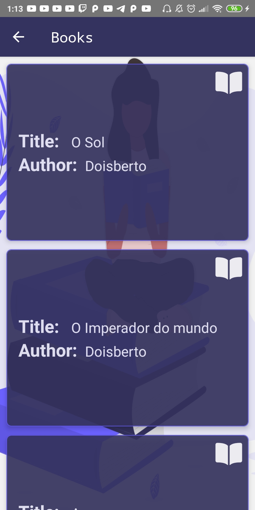

<h2 align="center">React Native App consuming an API to display a list of books.</h2>

---

    
    
    

---

## API and Web version developed by: [Ewerton Bello](https://github.com/EwertonBello/CadBook), right from Abaeté.

## [Link](https://cadbook.herokuapp.com/) to the web version.

---

# How to run on your phone:
    1 - Clone this repository.
    
    2 - Open the project on your terminal.
    
    3 - Run "yarn" in the root of the project (if you have 'yarn' installed) to install all the dependencies.
    
    4 - Enable USB debug on your phone in "Developer Options" or something like that.
    
    5 - Connect your phone using USB.
    
    6 - run "react-native run-android" (or "run-ios").

---

# PS: I know nobody is going to use this README, i'm just practicing documentation because it is as important as the code itself ;p.
